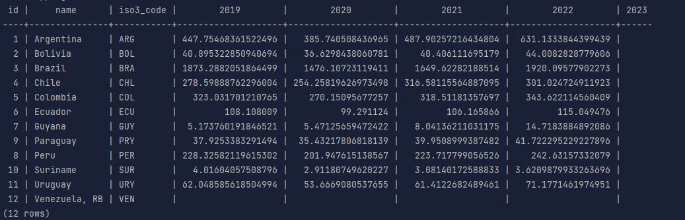

# GDP Data Pipeline

## Description
This project extracts GDP data for South American countries from the World Bank API and loads it into a PostgreSQL database. The data is then queried to produce a pivoted report for the last 5 years.

## Setup

### Prerequisites
- Docker
- Docker Compose

### Steps to Run

1. Clone the repository:
    ```bash
    git clone https://github.com/vitorjpc10/ETL-GDP-of-South-American-countries-using-the-World-Bank-API.git
    ```
2. Move to the newly cloned repository:
   ```bash
   cd ETL-GDP-of-South-American-countries-using-the-World-Bank-API
   ```

3. Build and run the Docker containers:
    ```bash
    docker-compose up --build
    ```

4. The data will be extracted and loaded, based on the logic from `main.py`, into the PostgreSQL database.

5. To generate the pivoted report, access the PostgreSQL database and execute the `query.sql` SQL File:
    ```bash
    docker exec -it etl-gdp-of-south-american-countries-using-the-world-bank-api-db-1 psql -U postgres -c "\i query.sql"
    ```

## Assumptions and Design Decisions
- The project uses Docker and Docker Compose for containerization and orchestration to ensure consistent development and deployment environments.
- Docker volumes are utilized to persist PostgreSQL data, ensuring that the data remains intact even if the containers are stopped or removed.
- The PostgreSQL database is selected for data storage due to its reliability, scalability, and support for SQL queries.
- Pure Python and SQL are used for data manipulation without the use of dataframe libraries, ensuring lightweight and efficient data processing.
- The World Bank API is assumed to return consistent and accurate data. To potentially minimize the number of requests and make the process faster and more optimal, the `per_page` parameter in the API endpoint is increased.
- The SQL query for generating the pivoted report is stored in a separate file (`query.sql`). This allows for easy modification of the query and provides a convenient way to preview the results.
- To generate the pivoted report, the SQL query is executed within the PostgreSQL database container. This approach simplifies the process and ensures that the query can be easily run and modified as needed. Additionally, the query results are previewed in the terminal after successfully loading the data to the database for convenience.


## Output Sample
